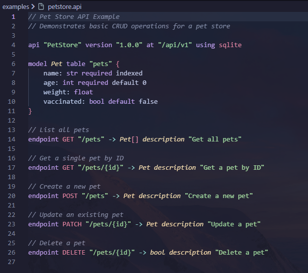

# Apiary

[](https://github.com/Ignema/apiary/actions)
[](https://www.python.org/downloads/)
[](https://opensource.org/licenses/MIT)

A Model-Driven Engineering (MDE) toolkit that transforms REST API specifications written in a custom Domain-Specific Language (DSL) into production-ready FastAPI applications with SQLModel persistence.

## Overview

Apiary demonstrates the complete MDE pipeline:
- **Metamodel Definition**: Ecore-inspired metamodel for REST APIs using Python dataclasses
- **Concrete Syntax**: Custom DSL with ANTLR grammar
- **Model Transformation**: AST to metamodel conversion
- **Validation**: OCL-inspired semantic constraint checking
- **Code Generation**: Jinja2 templates producing FastAPI applications

## Features

- 🚀 Generate complete FastAPI applications from simple DSL specifications
- 📝 Intuitive DSL syntax for defining models and endpoints
- ✅ Automatic validation of API specifications
- 🗄️ SQLModel ORM with SQLite and PostgreSQL support
- 📚 Automatic OpenAPI documentation (Swagger UI and ReDoc)
- ⚡ UV-based dependency management for fast setup
- 🔧 CRUD operations generated automatically

## Installation

### Prerequisites

- Python 3.11 or higher
- UV package manager ([installation guide](https://docs.astral.sh/uv/getting-started/installation/))

### Install Apiary

```bash
# Clone the repository
git clone https://github.com/Ignema/apiary.git
cd apiary

# Install dependencies
uv sync

# Install with dev dependencies
uv sync --extra dev
```

## Quick Start

### 1. Create a DSL File

Create a file `myapi.api` with your API specification:



### 2. Generate FastAPI Application

```bash
uv run apiary generate myapi.api ./output
```

### 3. Run the Generated Application

```bash
cd output
uv sync
uv run uvicorn main:app --reload
```

### 4. Access the API

- API: http://localhost:8000/api/v1
- Swagger UI: http://localhost:8000/docs
- ReDoc: http://localhost:8000/redoc

## DSL Syntax Reference

### API Declaration

```
api "<Name>" version "<semver>" at "<base_path>" using <database>
```

- **Name**: API name (PascalCase recommended)
- **version**: Semantic version (e.g., "1.0.0")
- **base_path**: Base URL path (e.g., "/api/v1")
- **database**: `sqlite` or `postgres`

### Model Declaration

```
model <ModelName> table "<table_name>" {
    <field_name>: <type> [modifiers]
    ...
}
```

**Supported Types**:
- `str`: String
- `int`: Integer
- `float`: Floating point number
- `bool`: Boolean
- `datetime`: Date and time

**Field Modifiers**:
- `required`: Field cannot be null
- `unique`: Field value must be unique
- `indexed`: Create database index
- `default <value>`: Default value

**Example**:
```
model Task table "tasks" {
    title: str required indexed
    description: str
    completed: bool default false
    priority: int default 1
    due_date: datetime
}
```

### Endpoint Declaration

```
endpoint <METHOD> "<path>" -> <ResponseType> description "<text>"
```

**HTTP Methods**: `GET`, `POST`, `PUT`, `PATCH`, `DELETE`

**Response Types**:
- `ModelName`: Single model instance
- `ModelName[]`: Array of model instances
- `bool`: Boolean (typically for DELETE operations)

**Path Parameters**: Use `{param}` syntax (e.g., `/pets/{id}`)

**Examples**:
```
endpoint GET "/tasks" -> Task[] description "Get all tasks"
endpoint GET "/tasks/{id}" -> Task description "Get a task by ID"
endpoint POST "/tasks" -> Task description "Create a new task"
endpoint PATCH "/tasks/{id}" -> Task description "Update a task"
endpoint DELETE "/tasks/{id}" -> bool description "Delete a task"
```

## Examples

The `examples/` directory contains sample DSL files:

### Pet Store API
```bash
uv run apiary generate examples/petstore.api ./petstore-app
```

### Task Manager API
```bash
uv run apiary generate examples/taskmanager.api ./taskmanager-app
```

## Generated Application Structure

```
output/
├── main.py              # FastAPI app with routes
├── models.py            # SQLModel classes
├── database.py          # Database engine and session
├── pyproject.toml       # UV project configuration
├── .python-version      # Python version
└── README.md            # Setup instructions
```

## Development

### Running Tests

```bash
# Run all tests
uv run pytest

# Run with coverage
uv run pytest --cov=src

# Run specific test file
uv run pytest tests/unit/test_parser.py
```

### Regenerating ANTLR Parser

If you modify the grammar file:

```bash
java -jar lib/antlr-4.13.1-complete.jar -Dlanguage=Python3 -visitor -o src/parser/generated src/parser/grammar/RestAPI.g4
```

## Architecture

Apiary follows a pipeline architecture with four main stages:

1. **Parser**: ANTLR-based DSL parser converts text to Abstract Syntax Tree (AST)
2. **Transformer**: Converts AST to metamodel instances
3. **Validator**: Enforces semantic constraints (OCL-inspired)
4. **Generator**: Produces FastAPI code using Jinja2 templates

```
DSL File → AST → Metamodel → Validated Model → Generated Code
```

## Validation Rules

Apiary enforces the following semantic constraints:

- ✅ Endpoint paths must be unique per HTTP method
- ✅ Model names must start with uppercase letters
- ✅ Table names must be lowercase with underscores
- ✅ POST/PUT/PATCH endpoints must specify request models
- ✅ Path parameters must exist in endpoint definitions
- ✅ Version strings must follow semantic versioning

## Technology Stack

- **Python 3.11+**: Modern type hints and performance
- **ANTLR4**: Parser generator for DSL
- **Jinja2**: Template engine for code generation
- **FastAPI**: Web framework for generated applications
- **SQLModel**: ORM combining SQLAlchemy and Pydantic
- **UV**: Modern Python package manager

## License

MIT License

## Contributing

Contributions are welcome! Please see [CONTRIBUTING.md](CONTRIBUTING.md) for guidelines.

## Changelog

See [CHANGELOG.md](CHANGELOG.md) for version history and release notes.
